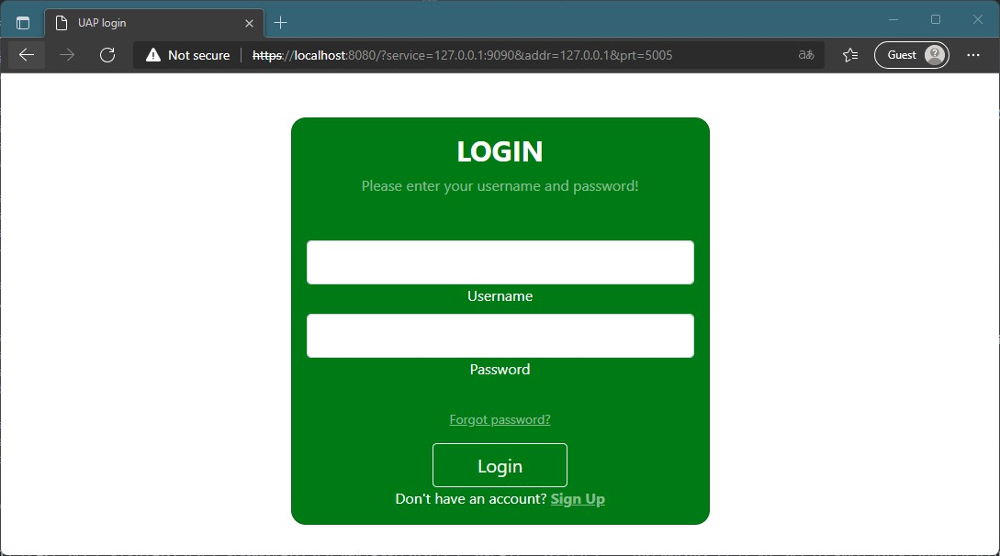
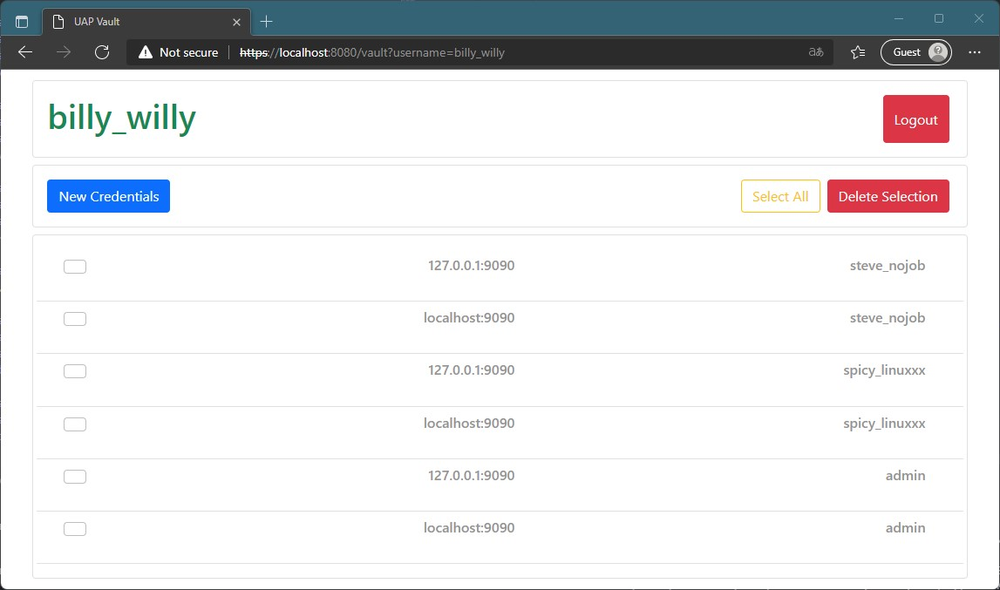
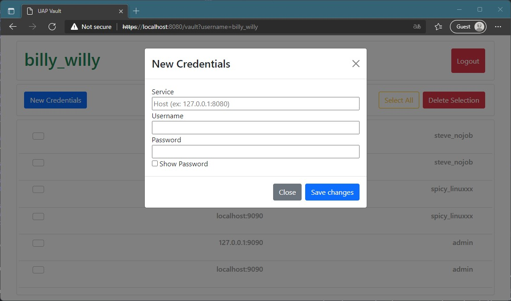
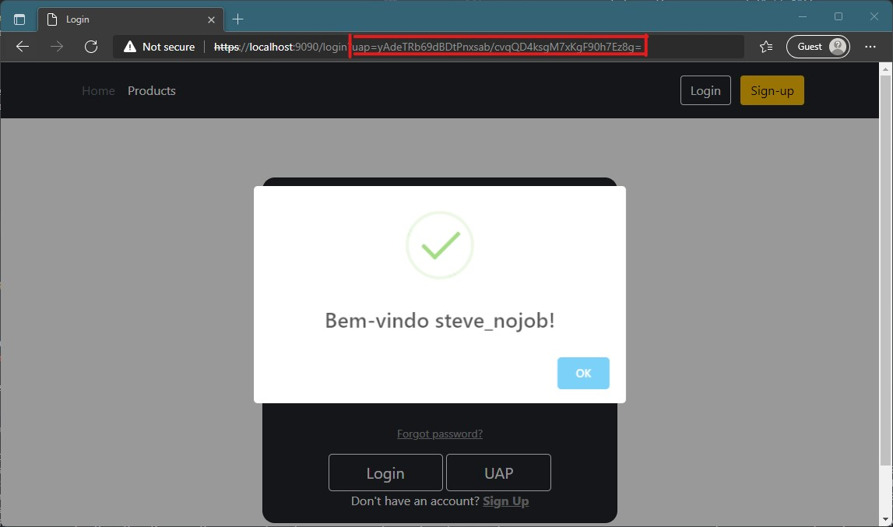

# Project 2

## Final Grade - 20/20

## Description

In this project we were asked to deliver a application that combines the advantageous characteristics of both a **password manager** as well as providing a **E-CHAP authentication protocol** that is able to communicate with any service that allows it.

To accomplish this objective, both a **authentication application** aswell as a **testing service** were needed. The first one had to be built from scratch while the second was an **adaptation** of the [**previous project**](https://github.com/detiuaveiro/project-1---vulnerabilities-equipa_1). 

## UX

### Interfaces

The entirety of the **UAP** interface is **browser based**, served by a **microservice** (cherrypy) is create as **local** connection wich the user can access via the browser to view and manage his/hers information.

The design layout and flow of the authentication application took a little inspiration of some well known services. The **password manager** side of things, was inspired by **LastPass** design when it comes to user management of password (addition, edition and deletion of entries). While the **login and authentication** interface was inspired by the Universitys own service of authetication.

### Serving content

The contents, as said previously, was served by a **Cherrypy** microservice, but the dynamic content of the service is handle by **Javascript** and **JQuery Ajax** POST requests to the service.

[](https://getbootstrap.com/)
[](https://www.javascript.com/)
[](https://jquery.com/)

## UAP

To acess the services of the UAP, one must first iniciate the service in the UAP directory

``` bash
C:\uap> python3 server.py
```

The UAP contains **three pages** that allow the for the user to acomplish thre main tasks
- [**Sign-Up**](#sign-up) to the UAP
- [**Login**](#login) to the UAP
- [**Managing**](#management) the user's credentials

### Sign-Up

To be able to take adavantage of the UAP services, one must first create a **user account**. To create it, one must provide a **username and a password**

Because of this system, the UAP is able to mantain **multiple users**, each one with it's own unique and separate **credentials database**

Upon a new user provide sign up data, the UAP service will be able accomplish a few things:

1. **Check** if the username **already exists**
	1. **Doesn't exist**
		1. Create a **new SQLite database** with the file name being a **MD5** hash of the **username**, this is done so that if ther is a breach of the directories where the databases are stored, it's much more **dificult to tied a connection between a user and it's database**
		2. It then adds a new **row** to the **users table** of the UAP where it is stored: 
			1. **id** - Composed of a sequential number concatenated with the username
			2. **username** - username provided by the user
			3. **nonce** - a random 24 bytes value (updated every time that user's database is **updated**)
			4. **secret** - This is the **nonce** value **encrypted** with the same cipher as the **database** (This will be explained [later](#login))
			5. **database** - **path** to the database file of that specific user
	2. **Exists**
		1. Informs the user of that, and asks for another username

``` python
@cherrypy.expose
@cherrypy.tools.json_out()
@cherrypy.tools.json_in()
def signup_validation(self):
input = cherrypy.request.json
username = decode64(bytes(input["username"], "utf-8")).decode("utf-8")
hash = decode64(bytes(input["hash"], "utf-8")).decode("utf-8")

db = sqlite3.connect("login.db")
cur = db.cursor()

com = """SELECT * FROM users WHERE username= ?"""
arg = (username,)
match = cur.execute(com, arg)

response = {"success": 1, "message": "Welcome to the Vault !"}

if match.fetchone() != None:
    response = {
	"success": 0,
	"message": "Username " + str(username) + " já existe",
    }
else:
    nonce = get_random_bytes(24)
    key = PBKDF2(hash, nonce, 32, count=1000000,
		 hmac_hash_module=SHA512)
    cipher = ChaCha20.new(key=key, nonce=nonce)
    secret = cipher.encrypt(nonce)

    path = database_builder(username)
    com = """INSERT INTO users (username, database) VALUES (?,?)"""
    arg = (username, path)
    cur.execute(com, arg)
    db.commit()

    cherrypy.session[cherrypy.session.id] = username
    cherrypy.session["database"] = path
    cherrypy.session["hash"] = hash

    database_encryptor()

db.close()
return json.dumps(response)
```

### Login

Since the security of the user's database is paramout, and the **key** to the encryption of these databases is derived **from the hash** of each user's password, it's important that the UAP has **zero knowledge** of the passwords.

The login process of the **UAP** is done via a **"decrypting challange"** type authentication, using logical deduction of the correcteness of the password instead of comparison with a saved value. For a user to be able to login, after providing the password, it will be **hashed* and along whith the **nonce** stored in the database, will try and **decrypt the secret**. Only if this decryption is successfull will the user be able to login, and the UAP test the successfulness of this decryption by **comparing it to the nonce**, since we know the secret is just the encryption version of it. This is extra secure, because the nonce **changes** everytime that **user's database** is encrypted, and consequently also does the **secret**, this way, the UAP database not only will never be close to know the password because even the hash of if will only be stored **in session RAM memory** but also the necessary data that is known to the UAP is **always different in every login**.

``` python
def logger(username, hash):
    db = sqlite3.connect("login.db")
    cur = db.cursor()

    com = """SELECT secret, nonce, database FROM users WHERE username = ?"""
    arg = (username,)
    match = cur.execute(com, arg)
    r = match.fetchone()

    response = {"success": 0, "message": "Username ou password incorrect"}

    if r != None:
        secret = decode64(r[0])
        nonce = decode64(r[1])
        database = r[2]

        key = PBKDF2(hash, nonce, 32, count=1000000,
                     hmac_hash_module=SHA512)
        cipher = ChaCha20.new(key=key, nonce=nonce)
        reveal = cipher.decrypt(secret)

        if reveal == nonce:
            cherrypy.session[cherrypy.session.id] = username
            cherrypy.session["database"] = database
            cherrypy.session["nonce"] = nonce
            cherrypy.session["hash"] = hash

            response = {"success": 1, "message": "Welcome to the Vault"}

    db.close()
    return response
```

#### Login Interface


This page is not only used to login the user to the UAP, it is also the same page to receive the data in the UAP authentication protocol with the service, the diference being in the URL

In this case, wher the arguments are **null**, the ajax request is send to the _login_validation()_ method, and if successfull, redirects the user to the **UAP management** page, if the arguments are **not null** as in the image bellow, the **E-CHAP protcol** is performed, and at the end the user will be **ridirected back to the original website**



### Management



In the management page, a user can do simple tasks like, create **new credentials** entries, edit the existing ones and deleting them.

To create new credentials for services the form bellow is shown to the user, then the **url to that service** must be provided. This url is used to search for the credentials of a service upon being referred by it, so it is import the **url** is exactly the same of the service. This is the same logic that is applied to services like **LastPass**.

The username of the account to that service will also be needed. This is also fundamental because this **username is sent** to the service in the beginning of the **E-CHAP** so the **service can identify which user is requesting authentication**

Lastly, the password to that services is required. This password is **saved in clear text**, so the hash and other functions needed to perform with in can be accomplished.



## Encryption and Decryption

### Encryption
``` python
def database_encryptor():
    database = cherrypy.session.get("database")
    hash = cherrypy.session.get("hash")

    nonce = get_random_bytes(24)
    key = PBKDF2(hash, nonce, 32, count=1000000,
                 hmac_hash_module=SHA512)
    cipher = ChaCha20.new(key=key, nonce=nonce)

    secret = cipher.encrypt(nonce)

    db = sqlite3.connect("login.db")
    cur = db.cursor()
    com = """UPDATE users SET secret=?, nonce=? WHERE username=?"""
    arg = (encode64(secret).decode("utf-8"), encode64(nonce).decode("utf-8"),
           cherrypy.session.get(cherrypy.session.id),)
    cur.execute(com, arg)
    db.commit()
    db.close()

    data = None
    with open(database, "rb") as file:
        r_d = file.read()
        data = cipher.encrypt(r_d)
    with open(database, "wb") as file:
        file.write(data)

    cherrypy.session["nonce"] = nonce
```
### Decryption
``` python
def database_decryptor():
    database = cherrypy.session.get("database")
    nonce = cherrypy.session.get("nonce")
    hash = cherrypy.session.get("hash")
    key = PBKDF2(hash, nonce, 32, count=1000000,
                 hmac_hash_module=SHA512)
    cipher = ChaCha20.new(key=key, nonce=nonce)

    cipher.seek(24)

    data = None
    with open(database, "rb") as file:
        r_d = file.read()
        data = cipher.decrypt(r_d)
    with open(database, "wb") as file:
        file.write(data)
```

The user's databases are encrypted using [XChaCha20](https://pycryptodome.readthedocs.io/en/latest/src/cipher/chacha20.html), with a **24 byte** nonce and the **SHA3 hash** of the password provided by the **Javascript** in the browser

The encryption and decryption is used fairly often during the execution of the UAP, **everytime** the database is **updated**. The other way was to decrypt on login and encrypt on logout, but by choosing to have the database always encrypted and only decrypting on updating, we can **reduce the chance of the database being left decrypted** if an error occurs.

## E-CHAP
### Service (app_auth)
``` python
def socket_connection(ip_addr, tcp_port):
    server = socket.socket(socket.AF_INET, socket.SOCK_STREAM)
    server.bind((ip_addr, tcp_port))
    server.listen(5)
    client_socket, address = server.accept()

    challenge = get_random_bytes(32)
    try:
        username = client_socket.recv(1024).decode('utf-8')
        client_socket.send(challenge)
        res = response(challenge, getHash(username))
        n = int.from_bytes(client_socket.recv(1024), "big")
        
        passed = True
        client_socket.send(res[0:n])
        for x in range(0, int(len(res))-n, int(2*n)):
            a_res = client_socket.recv(1024)
            nn = int(2*n + x)
            if a_res == res[x+n:nn]:
                client_socket.send(res[nn:nn+n])
            else:
                passed = False
                w = get_random_bytes(int(n/8))
                client_socket.send(bytes(bin(w[0])[2:], "utf-8"))
        
        if passed:
            salt = get_random_bytes(16)
            uap_token(salt, username)
            client_socket.send(salt) 
    except (socket.timeout, socket.error):
        print('Client {} error. Done!'.format(address))

    client_socket.close()
```

### UAP
``` python
def socket_connection(address, port, service,username, hash):
    server_socket = socket.socket(socket.AF_INET, socket.SOCK_STREAM)
    server_socket.connect((address, port))

    key = None
    try:
        server_socket.send(username.encode("utf-8"))
        challenge = server_socket.recv(1024)
        res = response(challenge, hash)
        n = 8
        server_socket.send(bytes([n]))

        passed = True
        for x in range(n, int(len(res)), int(2*n)):
            a_res = server_socket.recv(1024)       
            if a_res == res[x-n:x]:
                server_socket.send(res[x:x+n])
            else:
                passed = False
                w = get_random_bytes(int(n/8))
                client_socket.send(bytes(bin(w[0])[2:], "utf-8"))

        if passed:
            salt = server_socket.recv(1024)
            key = PBKDF2(hash, salt, 32, count=1000000,
                        hmac_hash_module=SHA512)
            server_socket.close()
            return "Secure login approved", encode64(key).decode("utf-8")
    except (socket.timeout, socket.error):
        print('Server error. Done!')

    server_socket.close()
    return "Secure login revogued", None
```

### Response to challenge
``` python
def response(challenge, hash):
    a = PBKDF2(hash, challenge, 64, count=1000000, hmac_hash_module=SHA512)
    b = base64.b64encode(a).decode("utf-8")
    response = "".join(format(ord(i), "08b") for i in b)
    return response.encode("utf-8")
```

When the service ridirects to the UAP, it will also **open a socket** and will wait and listen until something connects to it.

The order of the next sends and receives is:
1. When the UAP connects, we will send the username to **identify itself** to the service, this username will be used by the service to retrive the hash it has stored for that particular user.
2. Next, the **service** will respond with a **challange**, this challenge is a **24 bytes** random value.
3. The **uap** sends a **single integer** (in form of bytes since the socket only communicates in bytes) informing the **size** of the transition it will **send** and wants to **receive**

In the E-CHAP protocol, both the **service and UAP** will generate a a **response**, this response is a a string of bits generated by the encoding in **base 64 of a key** derived from the **SHA3 hash of the password** ant the the challange, wich is used as the **nonce for the PBKDF2**.

Then, and the most importante part of the authentication process, the service and the UAP will change **parts of the response** intermittently, until the end of the response, each **pices is 8 bits long**, so if one sends **response[0:8]** the next would respond with **response[8:16]**. Of course, by doing soo, de _"first senders advantage"_ is mitigated since both are the first or the second in half of the transmissions.

When the one of them receives a freagment of the response, it will **compara it** with the correspondent part of **it's own response**, and only if it's equal will it respond will a **truth** next segment. If it detects at some point that that they don't correspond, from that point on it will send **random data**.

At the end, if every transisition evaluated as **correct**, the **last message** from the service will be used as a **salt** to calculate a key in each side, this key will act as a **authentication token**. The service will store it along side the user data in it's data base, and the UAP will pass it to it's own interface, wich when **ridirecting** back to the service, will **pass the token as a GET parameter**.

The service upon receiving this token, will search it's user's database for it, when found will **attribute permissions** to the said user, treating it like a logged in user.



## Authors
[**Contribution stats**](https://github.com/detiuaveiro/project-2---authentication-equipa_1/pulse)

[David Ferreira - 93444](https://bit.ly/davidaraujo98)

Ana Filipe - 93350

Leandro Rito - 92975

Mariana Gomes - 73211
